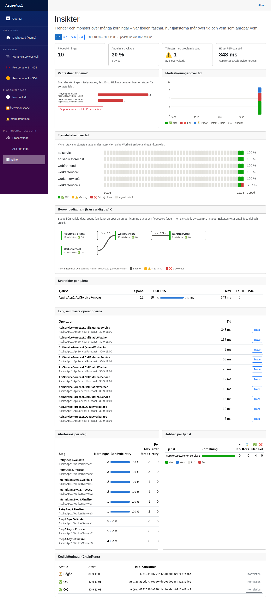

# AspireApp – distribuerad spårningsdemo
En Aspire-baserad mikrotjänstdemo för W3C Trace Context, ActivitySource, asynkrona Worker-steg och visuell felsökning i StateStore.


## Getting Started (köra lokalt)

Fungerar på macOS, Linux och Windows. StateStore använder **SQLite som standard**, så ingen databasserver behövs.

### 1. Förutsättningar (en gång)

1. **.NET 10 SDK** (10.0.303 eller senare, se `global.json`)
   ```bash
   # macOS
   brew install --cask dotnet-sdk
   dotnet --list-sdks
   ```
2. **Aspire CLI**. Krävs eftersom AppHost använder `AspireUseCliBundle` (annars fel `ASPIRE009` vid build).
   ```bash
   curl -sSL https://aspire.dev/install.sh | bash
   # alternativt: dotnet tool install -g Aspire.Cli
   ```
3. **Lita på HTTPS-utvecklarcertifikatet**
   ```bash
   dotnet dev-certs https --trust
   ```

### 2. Bygg och starta

```bash
git clone <repo-url>
cd AspireAppExampleApiServices
dotnet build AspireApp1.slnx
aspire run          # eller: dotnet run --project AspireApp1.AppHost
```

1. Terminalen skriver ut en länk till **Aspire Dashboard** (med inloggningstoken). Öppna den.
2. Klicka på endpointen för **webfrontend** för att öppna appen.
3. Gå till `/flowdemo`, starta ett flöde och följ länken **Visa i Processflöde** direkt när Trace ID visas. Sök på samma 32-teckens Trace ID i Aspire Dashboard → Traces. Processvyn visar sparad stegstatus även om tracen inte exporterades (sampling eller ingen OTLP-exporter).
4. Prova `/retrydemo` för retries och `/flowruns` för tidigare körningar. Observera att tekniskt Trace ID kan vara detsamma över tjänster medan varje span har eget Span ID; Correlation ID och Flow Run ID är separata affärsidentifierare.

SQLite-databasen skapas automatiskt i LocalApplicationData, dvs.
`~/.local/share/AspireApp1/statestore.db` på macOS/Linux och `%LOCALAPPDATA%\AspireApp1\statestore.db` på Windows.
Radera filen om du vill börja om med en tom databas.

### Bygga och köra i VS Code

1. Installera tillägget **C# Dev Kit** (VS Code föreslår det automatiskt via `.vscode/extensions.json`).
2. Öppna projektet från terminalen så att VS Code ärver din `PATH` (viktigt om .NET ligger i `~/.dotnet`):
   ```bash
   code .
   ```
3. **Bygg:** `⌘⇧B` (kör tasken `build` = `dotnet build AspireApp1.slnx`).
4. **Kör/debugga:** `F5` och välj **AppHost (Aspire)**. Dashboard-länken visas i *Debug Console*.
5. **Tester:** `⌘⇧P` → *Tasks: Run Test Task*, eller Testing-panelen i C# Dev Kit.

### Felsökning: HTTPS-certifikatet på macOS

Om `dotnet dev-certs https --trust` misslyckas:

- **`There was an error saving the HTTPS developer certificate...`**: lås upp nyckelringen och försök igen:
  ```bash
  security unlock-keychain ~/Library/Keychains/login.keychain-db
  dotnet dev-certs https --clean
  dotnet dev-certs https --trust
  ```
- **`The authorization was denied since no user interaction was possible`**: macOS kräver att du godkänner
  i en ruta på skärmen. Det går **inte** via SSH (t.ex. Termius från iPad), inte ens med `sudo`.
  Kör `dotnet dev-certs https --trust` i **Terminal.app direkt på datorn**, eller öppna
  **Nyckelhanterare → login → Certifikat**, sök `localhost`, dubbelklicka och välj **Lita på → Lita alltid på**.
- Verifiera med `dotnet dev-certs https --check --trust` (ska visa "A trusted certificate was found").
- Kör **inte** `--clean` efteråt, då skapas ett nytt (obetrott) certifikat.

Om du bara kommer åt datorn via SSH kan du köra utan betrott certifikat och tunnla portarna
(Dashboard `15259`, Web Frontend `5004`) med SSH port forwarding:

```bash
export ASPIRE_ALLOW_UNSECURED_TRANSPORT=true
dotnet run --project AspireApp1.AppHost --launch-profile http
```

### 3. Kör testerna

```bash
dotnet run --project AspireApp1.Tests
```

Testprojektet använder Microsoft.Testing.Platform, så `dotnet test` (VSTest-läget) fungerar inte på .NET 10 SDK.

## Arkitekturöversikt

För en samlad helhetsbeskrivning av hur alla tjänster, flöden, spårning och datalagring hänger ihop, se:

- [CLAUDE.md](CLAUDE.md)

## DIGG + W3C Trace Context (spårbarhet)
- `AspireApp1.ServiceDefaults/Extensions.cs` konfigurerar W3C-format, OpenTelemetry-loggar/metrics/traces och OTLP-export när `OTEL_EXPORTER_OTLP_ENDPOINT` finns (Aspire sätter den lokalt). Egna aktiviteter per tjänst använder dess applikationsnamn som `ActivitySource`, t.ex. `AspireApp1.WorkerService2` (samma namn som `AddSource` registrerar). Domänaktiviteter inkluderar `FlowRun.Start`, `FlowStep1.SyncValidate`, `FlowStep2.AsyncProcess`, `FlowStep3.AsyncFinalize`, `Worker.ProcessJob` och `ChainTrigger.Run`. Processvyns sparade `FlowStepRecord.StepName` använder t.ex. `Step1.SyncValidate` utan `Flow`-prefix. Span-attribut använder punktnotation (`flow.run.id`, `job.id`, `retry.attempt`), strukturerade loggfält understreck (`flow_run_id`, `job_id`, `retry_attempt`); lägg aldrig payload eller personuppgifter i attribut.
- ASP.NET Core skapar server-span (även en ny trace utan inkommande header); `IHttpClientFactory`/HTTP-instrumenteringen skapar klient-span och skickar `traceparent` samt `tracestate`. Skapa inte ytterligare klient-span för samma HTTP-anrop. Manuella aktiviteter används för domänsteg och kan vara `null` vid sampling; skapa då inte påhittade span-ID:n i StateStore.
- `trace_id` (32 hex) identifierar den tekniska tracen och `span_id` (16 hex) ett steg. `correlation_id`, `flow_run_id` och `job_id` är **separata affärs-ID:n**, inte ersättare för trace-ID. Den gemensamma HttpClient-handlern vidarebefordrar `X-Correlation-Id` endast när ett validerat/skapad affärs-ID finns; kopiera inte inkommande `traceparent` som ett svar. Loggscope för applikationsanrop innehåller `trace_id`, `span_id`, `service.name` och `timestamp_utc` i UTC. Logga status och undantagstyp, inte HTTP-svar/payload.
- `/jobs` och `/flow/step` är asynkrona HTTP-till-Worker-övergångar: meddelandekontraktet (fältet `Version`, nu 1) bär `TraceParent`, `TraceState` samt affärs-ID separat, eftersom HTTP-serveraktiviteten avslutas innan Worker behandlar kön. Okänd version avvisas; äldre meddelanden utan versionsfält tolkas som v1. Varje försök får en `Consumer`-aktivitet med meddelandets ursprungliga W3C-context som parent, så retry och slutligt fel/dead-letter behåller samma trace. `Producer` används vid köläggning. HTTP-headern överför också trace till mottagande endpoint; den ersätter inte kontexten i det kölagrade meddelandet. Vid byte till extern kö ska samma fält flyttas till transportmetadata.
- `Tracing:SamplingRatio` styr sampling av nya tracar (0–1, decimalpunkt i konfigurationen): `1.0` lokalt och `0.1` i produktion om den inte sätts. `ParentBasedSampler` respekterar inkommande W3C sampling-flagga. `/health`, `/alive`, Blazor-/frameworktrafik, statiska filer och StatusMonitor-pollningar filtreras ur traces; HTTP-frameworkets access-loggar och EF Core SQL-kommandon på informationsnivå filtreras också. Fel vid hälsokontroll loggas fortfarande och hälsostatus sparas; framework-/EF-varningar och fel behålls. Mät volym/overhead innan produktionsvärdet ändras.
- FlowRun/FlowStep/SpanRecord i StateStore ger Processflöde steg, status, varaktighet och felpunkt även utan fullständiga spans. SpanRecord använder riktiga Activity-ID:n; samplade tracar visas i Aspire Dashboard. Tekniska trace-ID:n kan sökas i båda vyerna utan att exponera payload.

### Felsökning via `trace_id`
1. Starta `AspireApp1.AppHost`.
2. Kör anrop från `webfrontend` till backend (exempel: väderflödet).
3. Öppna trace-vyn i Aspire dashboard och följ samma `trace_id` genom tjänstekedjan.
4. På sidan **Processflöde** kan du söka med:
   - ren `trace_id` (32 hex-tecken)
   - full `traceparent` (`00-<trace_id>-<span_id>-<flags>`)
   - Aspire URL-format, t.ex. `https://.../traces/detail/<trace_id>`
5. Processflöde visar stegindikering i formatet **Steg X/N** samt markerar var flödet fastnat med tjänst och felorsak.
6. Kontrollera worker-loggar för samma `trace_id` och separat `correlation_id` vid async-jobb/retry/finalt fel. För en fristående lokal demo, välj `StateStore:Provider=Sqlite` i AppHost och starta `/flowdemo`; jämför `trace_id` i Aspire Dashboard och `/processflow`. Välj en körning på `/flowruns` för att se steg, varaktighet och felpunkt.

## Frontend-visualisering av processflöde

För krav, specifikation och implementationsplan gällande frontend-visualisering av processflöde via `traceId`/`correlationId`, se:

- [Kravspecifikation: Frontend-visualisering av processflöde](docs/kravspecifikation-frontend-processflode.md)
- [Implementationsplan: Frontend-visualisering av processflöde](docs/implementationsplan-frontend-processflode.md)

## StateStore databas (SQLite eller SQL Server)

StateStore kan köras med både SQLite och SQL Server via konfiguration i `AspireApp1.AppHost/appsettings.Development.json` (globalt för hela lösningen).

```json
{
  "StateStore": {
    "Provider": "Sqlite"
  },
  "ConnectionStrings": {
    "statestoreSqlServer": "Server=.;Database=AspireApp1StateStore;Trusted_Connection=True;TrustServerCertificate=True;MultipleActiveResultSets=True"
  }
}
```

- **Default är `Provider = "Sqlite"`** (även om nyckeln saknas eller har okänt värde)
- `Provider = "SqlServer"` använder `ConnectionStrings:statestoreSqlServer`
- `Provider = "Sqlite"` använder delad fil i LocalApplicationData (sätts i AppHost om `ConnectionStrings:statestore` saknas)
- Databasen och tabellerna skapas automatiskt vid uppstart om de saknas (gäller både SQL Server och SQLite)
- AppHost skickar alltid båda nycklarna till tjänsterna:
  - `ConnectionStrings:statestore` = SQLite-anslutning
  - `ConnectionStrings:statestoreSqlServer` = SQL Server-anslutning

### Så växlar du provider
1. Öppna `AspireApp1.AppHost/appsettings.Development.json`.
2. Sätt `StateStore:Provider` till `Sqlite` eller `SqlServer`.
3. Kontrollera att motsvarande connection string är satt.
4. Starta om `AspireApp1.AppHost`.

Du kan också växla utan att ändra filen, via miljövariabel:

```bash
export StateStore__Provider=SqlServer
aspire run
```

> **SQL Server på macOS/Linux:** `Trusted_Connection=True` (Windows-autentisering) fungerar inte där.
> Kör SQL Server i Docker (`mcr.microsoft.com/mssql/server`) och använd en connection string med
> `User Id=sa;Password=...;TrustServerCertificate=True` i `ConnectionStrings:statestoreSqlServer`.

Startsidan i frontend visar nu aktiv provider under rubriken **Aktiv StateStore DB**.

Sidan `/flowruns` visar alla senaste flödeskörningar och länkar vidare till `/processflow`.

## Insikter (`/insights`)

Sidan **Insikter** visar trender och mönster över många körningar i ett valbart tidsfönster (1 h, 6 h, 24 h, 7 d) och uppdateras var 10:e sekund:

- **Var fastnar flödena?** – vilket steg/tjänst misslyckade körningar stannade på
- **Flödeskörningar över tid** – klara / fel / pågår per intervall
- **Tjänstehälsa över tid** – status per tjänst och upptid, från WorkerService4:s hälsokontroller
- **Beroendediagram** – byggs från verklig trafik (spans och flödesstegens överlämningar)
- **Svarstider** – P50/P95/max och HTTP-fel per tjänst, samt de långsammaste operationerna
- **Återförsök per steg**, **jobbkö** och **kedjekörningar**

Tidslinjevyn i `/processflow` har tidsaxel, indrag efter förälder–barn och markerar den **kritiska vägen**.



## Retry- och Intermittent-demo med konfigurerbar simulering

Formulären på `/retrydemo` och `/intermittentdemo` hämtar default-profiler från WorkerService1 (`GET /flow/simulation/profiles`) och skickar valda värden vid start av flöde.

Default-profilerna sätts i `AspireApp1.WorkerService1/appsettings.json` under `FlowSimulationProfiles`:

```json
{
  "FlowSimulationProfiles": {
    "RetryDemo": {
      "RetryAttempts": 3,
      "RetryDelayMs": 10000
    },
    "IntermittentDemo": {
      "RetryAttempts": 3,
      "NormalMinDelayMs": 10,
      "NormalMaxDelayMs": 500,
      "SlowMinDelayMs": 5000,
      "SlowMaxDelayMs": 30000,
      "SlowCallProbabilityPercent": 20,
      "Http500ProbabilityPercent": 15,
      "RetryDelayMs": 1000
    }
  }
}
```

- **RetryDemo** kör legacy-beteende som default: 3 försök med 10 sekunder mellan försök.
- **IntermittentDemo** kör sannolikhetsstyrd intermittent simulering (slow + HTTP 500) med 1–3 försök.
- `RetryAttempts` klampas till 1–3 innan körning.
